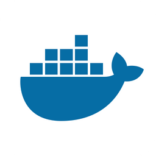
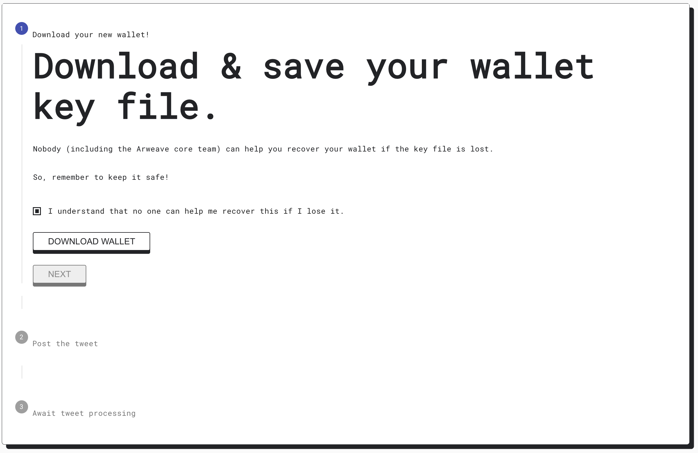

<div id="top"></div>

<!-- PROJECT LOGO -->
<br />
<div align="center">
  <a href="https://github.com/clementlvx/kyve-docker">
    
    
  </a>

  <h3 align="center">SCRIPT FOR RUNNING KYVE NODE ON DOCKER</h3>

  <p align="center">
    Kyve Links :
    <br />
    <a href="https://docs.kyve.network/">Documentation</a>
    ·
    <a href="https://blog.kyve.network/">Blog</a>
  </p>
</div>

### System Requirements

* [Ubuntu](https://ubuntu.com/download)
* [Docker](https://docs.docker.com/engine/install/ubuntu/)
* [Docker-Compose](https://docs.docker.com/compose/install/)
* [Wget](https://doc.ubuntu-fr.org/wget)


<!-- GETTING STARTED -->
## Getting Started

1. You need an Arweave Wallet. You can claim one [here](https://faucet.arweave.net).

    Rename your `.json` to `arweave.json` and put it in the directory where you will run the script.

    <a href="https://github.com/clementlvx/kyve-docker">
      
    </a>

2. Execute the script `install.js`
   ```sh
   wget -O - https://raw.githubusercontent.com/clementlvx/kyve-docker/main/install.sh | sh
   ```
   
3. Select in wich pool you want to create your KYVE node
    ```sh
    1) Moonbeam
    2) Avalanche
    3) Stacks
    4) Bitcoin
    5) Solana
    6) Zilliqa
    7) Near
    8) Celo
    9) EvmosEVM
    Pool :
    ```
  
4. Enter your Mnemonic Seed
    ```sh
    Mnemonic:
    ```
    
5. Enter how many $KYVE you want stacke
    ```sh
    Initial Stake:
    ```
    
## License

Distributed under the MIT License. See `LICENSE.txt` for more information.


<!-- CONTACT -->
## Contact

Klément - [@t_kl3ment](https://twitter.com/t_kl3ment)

Project Link: [https://github.com/clementlvx/kyve-docker](https://github.com/clementlvx/kyve-docker)

<p align="right">(<a href="#top">back to top</a>)</p>
